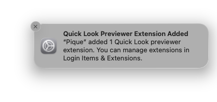

# Pique


A macOS Quick Look extension for syntax-highlighted previews of configuration files and scripts.

Select a file in Finder, press Space, and get a formatted preview with proper syntax highlighting to make your MacAdmin life easier — no need to open a text editor to glance at a config file.

## Supported File Types

| Format | Extensions |
|---|---|
| JSON | `.json` |
| YAML | `.yaml`, `.yml` |
| TOML | `.toml` |
| XML | `.xml` |
| Mobileconfig / Plist | `.mobileconfig`, `.plist` |
| Shell | `.sh`, `.bash`, `.zsh`, `.ksh`, `.dash` |
| PowerShell | `.ps1`, `.psm1`, `.psd1` |

Mobileconfig and plist files get a special HIG-inspired rendering with profile metadata, payload details, and formatted key-value pairs.

YAML files with embedded SQL in `query:` values (common in osquery/Fleet configurations) automatically highlight the SQL syntax.

## Requirements

macOS 26.0 or later.

## Installation

You can build from source with Xcode:

```sh
xcodebuild -project Pique.xcodeproj -scheme Pique -config Release
```

Or use the pkg installer available in [Releases](../../releases).

## Enabling the Extension

On macOS 26, Quick Look extensions must be explicitly allowed. When you first launch Pique, you will see a notification:



Go to **System Settings > Login Items & Extensions > Quick Look Extensions** and enable **Pique**.

## License

Copyright 2025 Declarative IT GmbH

Licensed under the Apache License, Version 2.0 (the "License");
you may not use this file except in compliance with the License.
You may obtain a copy of the License at

> <http://www.apache.org/licenses/LICENSE-2.0>

Unless required by applicable law or agreed to in writing, software
distributed under the License is distributed on an "AS IS" BASIS,
WITHOUT WARRANTIES OR CONDITIONS OF ANY KIND, either express or implied.
See the License for the specific language governing permissions and
limitations under the License.
